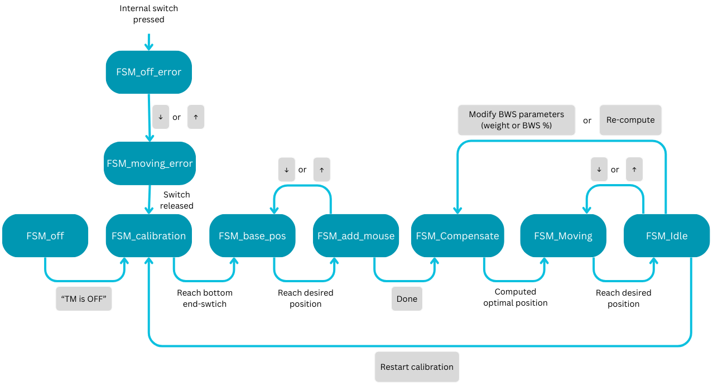
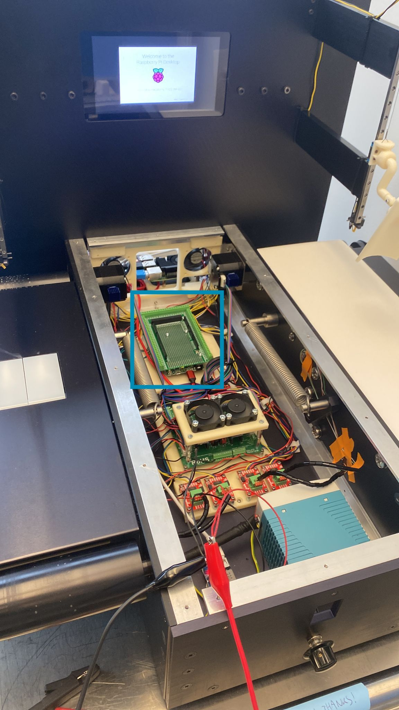

# G-Mill - Rodent Treadmill with Body Weight Support

A robotic treadmill system designed for neuroscience research with rodents, featuring automated body weight support (BWS) compensation.

<p align="center">
  
</p>

## Project Overview

### Background

The G-Mill hardware was designed and built by a previous student at G-lab (Grégoire Courtine's laboratory at EPFL). The mechanical system, including the treadmill, body weight support mechanism, and electronics, was already in place but the software was incomplete.

**This project's goal was to complete the software implementation** to achieve a fully functional treadmill with body weight support compensation. The main software contributions include:

- Fixing communication issues between the Arduino and Raspberry Pi
- Implementing the calibration procedure for the body weight support system
- Developing the body weight compensation algorithm
- Creating a reliable user interface
- Fixing and replacing minor hardware components

### Main Objectives

The G-Mill system provides:

1. **Motorized Treadmill Control** - Precise speed control with progressive acceleration/deceleration for smooth rodent locomotion studies
2. **Body Weight Support (BWS)** - Automated system that supports a configurable percentage of the rodent's body weight during experiments, essential for rehabilitation and locomotion research
3. **Multi-Species Support** - Configurable parameters for both mice and rats, with species-specific settings for weight ranges, spring constants, and speed limits
4. **Safety Systems** - End switches and limit detection to prevent mechanical damage and ensure animal safety
5. **Real-Time GUI** - Desktop application for researchers to control all parameters and monitor system state

### Key Features

- Bidirectional treadmill movement (forward/backward)
- Adjustable treadmill speed: -5 to +15 cm/s (mice) or -5 to +25 cm/s (rats)
- Body weight support: 0-100% of rodent weight
- Real-time position feedback via encoders
- Manual rotary encoder for hands-free speed adjustment
- State machine for safe operation sequences (calibration, rodent placement, running)

---

## Code Structure

The project consists of two main components:

```
treadmill_code/
├── README.md
├── images/                         # Project images
│   ├── treadmill_image.jpeg        # Main robot image
│   ├── FSM_states.png              # State machine diagram
│   ├── arduino.JPG                 # Arduino location
│   └── backside.JPG                # Backside view
├── code/
│   ├── G-Mill_Marianne.py          # Python GUI application
│   └── GMill_sw-main/              # Arduino firmware (PlatformIO project)
│       ├── platformio.ini          # PlatformIO configuration
│       └── src/
│           ├── main.cpp            # Main entry point
│           ├── parameters.h/.cpp   # System parameters & state machine
│           ├── treadmills.h/.cpp   # Treadmill motor control
│           ├── weightsupports.h/.cpp   # BWS motor control
│           ├── communication.h/.cpp    # Serial protocol (Arduino <-> GUI)
│           ├── manualencoder.h/.cpp    # Manual rotary encoder input
│           ├── motorencoders.h/.cpp    # Motor position encoders
│           ├── bwsencoders.h/.cpp      # BWS position encoders
│           └── endswitches.h/.cpp      # Safety limit switches
├── project_report_marianne_compressed.pdf
├── Support_for_next_student.pdf
└── User_manual.pdf
```

### Firmware Modules (C++/Arduino)

| Module | Description |
|--------|-------------|
| `main.cpp` | Main loop: reads sensors, controls motors, handles communication |
| `parameters` | Singleton class storing all system parameters (speed, weight, BWS%, species) and FSM states |
| `treadmills` | Stepper motor control for treadmill belts with progressive acceleration |
| `weightsupports` | BWS motor control with position feedback and spring compensation |
| `communication` | Serial protocol for bidirectional communication with the Python GUI |
| `manualencoder` | Rotary encoder input for manual speed adjustment during experiments |
| `motorencoders` | Encoder feedback for treadmill motor position |
| `bwsencoders` | Encoder feedback for BWS motor position |
| `endswitches` | Safety limit switch monitoring for BWS system |

### GUI Application (Python)

The `G-Mill_Marianne.py` file provides a Tkinter-based graphical interface with:

- **Weight Input** - Set rodent weight in grams (0-500g)
- **BWS Control** - Adjust body weight support percentage (0-100%)
- **Speed Control** - Set treadmill speed in cm/s
- **Species Selection** - Toggle between Mice and Rats modes
- **Treadmill ON/OFF** - Enable/disable motor output
- **Position Adjustment** - Manual up/down controls for BWS positioning
- **Calibration** - System calibration workflow

### State Machine (FSM)

The system operates through these states:

<p align="center">
  
</p>

| State | Description |
|-------|-------------|
| `FSM_off` | System off, motors disabled |
| `FSM_calibration` | Calibrating BWS position |
| `FSM_base_pos` | Moving to base position |
| `FSM_add_mouse` | Rodent placement mode |
| `FSM_Idle` | Ready, waiting for commands |
| `FSM_Moving` | Treadmill running |
| `FSM_Compensate` | Active BWS compensation |
| `FSM_moving_error` | Error during movement |
| `FSM_off_error` | Error, system stopped |

---

## Installation & Usage

### Hardware Requirements

- **Microcontroller**: Arduino Due
- **Treadmill Motors**: 2x Stepper motors (pins 2-3 step, 50-53 dir/enable)
- **BWS Motors**: 2x Stepper motors (pins 4-5 step, 46-49 dir/enable)
- **Encoders**: Motor encoders and BWS position encoders
- **End Switches**: 8x limit switches for BWS safety (pins 34-41)
- **Manual Encoder**: Rotary encoder with push button (pins 30, 31, 33)
- **Connection**: USB Serial at 115200 baud

### Hardware Architecture

<p align="center">
  
  
</p>

<p align="center">
  <em>Left: Arduino Due located inside the robot core. Right: Backside showing Raspberry Pi and connections.</em>
</p>

### Software Requirements

#### Firmware (Arduino Due)

1. Install [PlatformIO](https://platformio.org/) (VSCode extension or CLI)
2. Navigate to the firmware directory:
   ```bash
   cd code/GMill_sw-main
   ```
3. Build and upload:
   ```bash
   pio run --target upload
   ```

#### GUI Application (Python)

1. Install Python 3.x
2. Install required packages:
   ```bash
   pip install tkinter matplotlib numpy pyserial bitarray
   ```
3. Connect the Arduino Due via USB
4. Update the serial port in `G-Mill_Marianne.py` if needed:
   ```python
   ser = serial.Serial('/dev/ttyACM0', 115200, timeout=1)
   ```
   - Linux: `/dev/ttyACM0` or `/dev/ttyUSB0`
   - macOS: `/dev/cu.usbmodem*`
   - Windows: `COM3` (or appropriate COM port)

5. Run the GUI:
   ```bash
   python3 code/G-Mill_Marianne.py
   ```

### Usage Workflow

1. **Power on** the system and connect Arduino via USB
2. **Launch the GUI** application
3. **Select species** (Mice or Rats)
4. **Enter rodent weight** in grams
5. **Turn ON treadmill** - system will begin calibration
6. **Place rodent** when prompted, adjust position with arrows
7. **Click "Done"** when rodent is secured
8. **Set BWS percentage** and **treadmill speed**
9. Use **+/- buttons** to adjust parameters during experiment
10. **Turn OFF treadmill** when finished

### Serial Communication Protocol

Data is exchanged as formatted strings:

**GUI → Arduino:**
```
<CCCCCCCC|WWW|BBB|SS|T|P|R|MM>
```
- `C`: Changed values bitfield (8 bits)
- `W`: Weight (3 digits)
- `B`: BWS percentage (3 digits)
- `S`: Speed (2 digits)
- `T`: TM on/off (1 digit)
- `P`: Species (1 digit: 1=mice, 2=rats)
- `R`: Rodent added (1 digit)
- `M`: Move up/down (2 digits)

**Arduino → GUI:**
```
<CCCCCC|SS|P|R|S|ST|PS|BWSE|BWS>
```
- Position feedback and state information

---

## Documentation

Additional documentation is available in the repository root:

| Document | Description |
|----------|-------------|
| `project_report_marianne_compressed.pdf` | Full semester project report with technical details |
| `Support_for_next_student.pdf` | Guide for continuing development |
| `User_manual.pdf` | Detailed user manual for operating the robot |

---

## License

This project was developed as a Master's thesis. Please contact the author for usage permissions.
